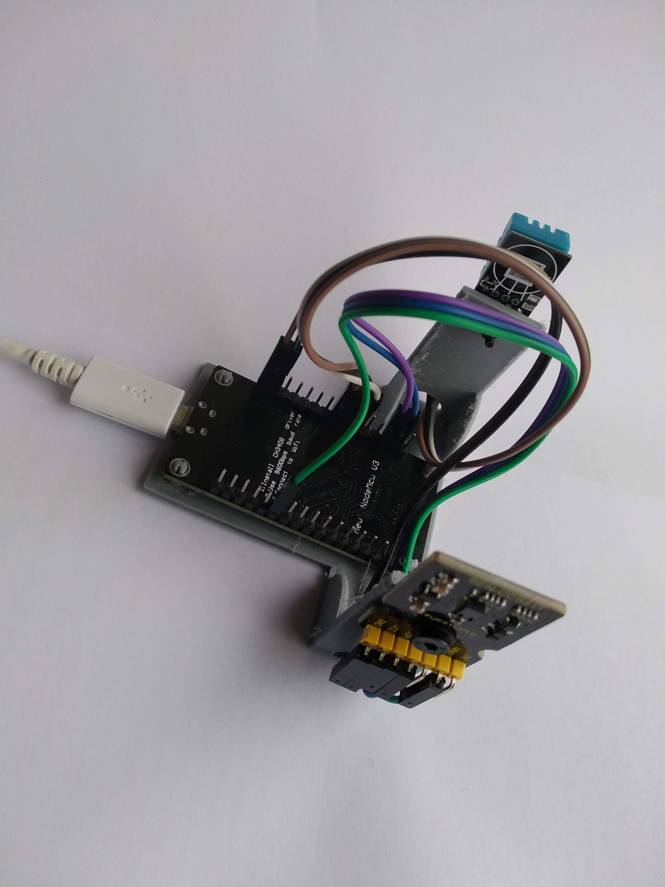

# fragolinos-medidorCO2
Medidor de CO2 para a aula realizado polo Club de Ciencias do IES Antonio Fraguas

## Explicación do proxecto
Este dispositivo foi deseñado para ser montado polos alumnos do Club de Ciencias. Os obxectivos era por unha parte introducir aos alumnos no mundo IOT, e por outro dispoñer dun medidor da calidade do aire das aulas.

O sensor [CSS811](https://www.sciosense.com/products/environmental-sensors/ccs811-gas-sensor-solution/) utilizado non mide CO2, se non [VOC](https://en.wikipedia.org/wiki/Volatile_organic_compound), e realiza unha estimación do CO2 a partir desas medicións. Non é realmente o sensor ideal, xa que resulta moi sensible a compostos químicos, como productos de limpeza ou colonias, pero a relación calidade-precio era un requisito. Un sensor CCS811 pódese atopar entre 10 e 15 Euros, mentras que un sensor de maís calidade non baixa dos 30 Euros.

O precio do sensor de humidade e temperatura [DHT11](https://learn.adafruit.com/dht) é moi barato (2 Euros), por eso se aproveitou para engadilo, dando información adicional do estado da aula.

En total montáronse 20 dispositivos, que foron instalados en distintas aulas de 1º, 2º, 3º e 4º da ESO. En cada aula había un cartel cun código QR que permitía o acceso á páxina de [thingspeak.com](https://thingspeak.com/)  cos datos e gráficas dos parámetros recollidos.

O coste de cada dispositivo foi aproximadamente duns 22 euros. Na carpeta docs existe unha folla de cálculo coa estimación dos costes de cada compoñente.

## Carpetas
* **doc**: Presentacións realizadas para explicar aos alumnos o proxecto e como manuais de montaxe.
* **src**: Código arduino
* **soporteESP8266**: ficheiros para a impresión 3D do soporte da placa e os sensores.
* **imaxes**: Diversas imaxes do sensor e os seus compoñentes.

## 
